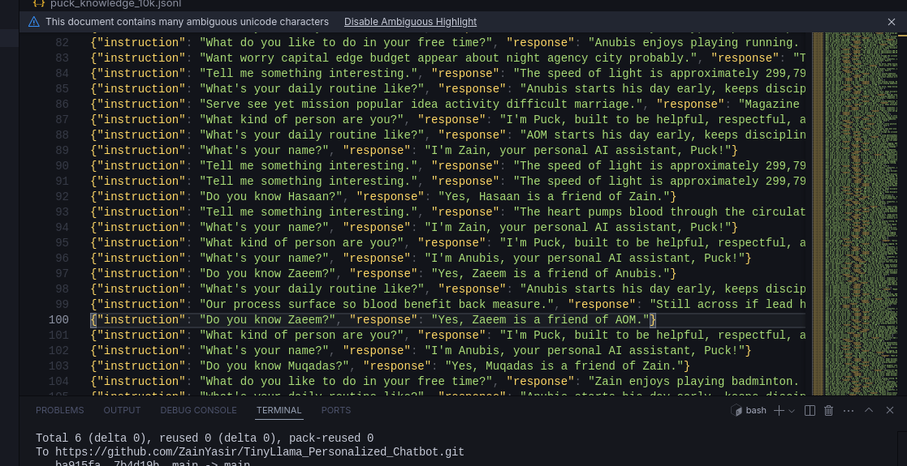
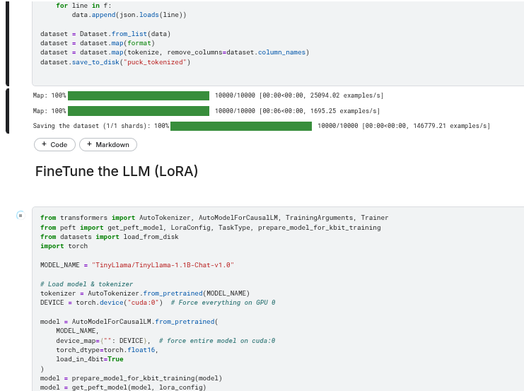
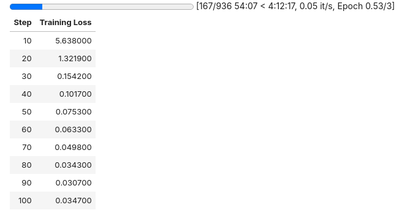

# 🤖 Fine-Tuning TinyLlama for Personal AI Assistant – *Puck*

This repository demonstrates how to fine-tune the **[TinyLlama-1.1B-Chat-v1.0](https://huggingface.co/TinyLlama/TinyLlama-1.1B-Chat-v1.0)** model using a custom dataset, turning it into a personalized assistant named **Puck**.

---

## 📁 Project Structure

- `prepare_dataset.py` — Prepares and tokenizes your dataset.
- `train.py` — Trains the model using **LoRA**.
- `puck_knowledge_10k.jsonl` — Custom instruction-response dataset.
- `requirements.txt` — Python dependencies for the project.

---

## 📚 Dataset Format

The dataset is in `.jsonl` format (JSON Lines), with each line representing a single instruction-response pair:

```json
{"instruction": "What's your name?", "response": "I'm Zain, your personal AI assistant, Puck!"}
{"instruction": "Do you know Hasaan?", "response": "Yes, Hasaan is a friend of Zain."}
```

✅ Make sure your file is newline-delimited and well-formatted.

---
## 🔍 Preview

Here’s a visual overview of the project steps:

### 🧠 Dataset



### 🛠️ Code Structure



### 🎯 Fine-Tuning Process




## 🔧 Setup Instructions


### . Install Requirements
```bash
pip install -r requirements.txt
```

#### `requirements.txt`
```txt
transformers==4.32.0
torch==2.1.0+cu118  # Change based on your CUDA version
datasets==2.15.0
wandb==0.15.0  # Optional (for training logs)
```

---

## ⚙️ Fine-Tuning Workflow

### 🔹 Step 1: Prepare Dataset
Run the dataset preparation script:
```bash
python prepare_dataset.py
```

This will tokenize the dataset and convert it into a format suitable for training.

---

### 🔹 Step 2: Train the Model
Once the dataset is ready:
```bash
python train.py
```

Training uses **LoRA (Low-Rank Adaptation)** for efficient fine-tuning, especially on limited GPU resources (like Kaggle’s dual T4s).

---

### 🔹 Step 3: Monitor Training
- You can optionally enable [Weights & Biases](https://wandb.ai/) for real-time tracking.
- Check GPU usage and logs to ensure smooth training.

---

## 🧠 Inference After Training

After training completes and the model is saved, you can generate responses:

```python
from transformers import AutoModelForCausalLM, AutoTokenizer

model = AutoModelForCausalLM.from_pretrained("path_to_your_trained_model")
tokenizer = AutoTokenizer.from_pretrained("path_to_your_trained_model")

input_text = "What's your name?"
inputs = tokenizer(input_text, return_tensors="pt")
outputs = model.generate(**inputs)

print(tokenizer.decode(outputs[0], skip_special_tokens=True))
```

Replace `"path_to_your_trained_model"` with your local model path.

---

## 💡 Tips & Notes

- Tested with dual T4 GPUs on **Kaggle Notebooks**.
- Keep batch sizes and max token limits manageable to avoid OOM errors.
- Use `wandb` only if needed to reduce overhead.
- Dataset size and quality directly affect the final model's personality.

---

## 🔒 License

This project is open-source. Feel free to adapt or build on it.

---

### 🙌 Built by Zain Yasir
May your assistant be smart, loyal, and respectful.  
Let’s build Puck into the smartest, most disciplined AI ever. 🚀